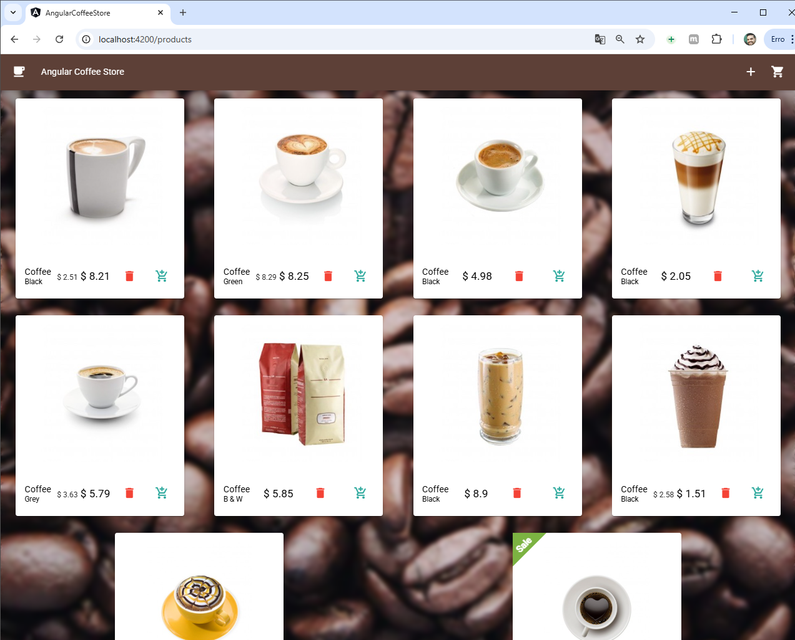

# Angular Coffee Shop


This is an online coffee store built with Angular that allows users to browse a list of products, add items to their shopping cart, modify quantities, remove products from the cart, and add new products to the product list.

The application leverages the latest features of Angular to provide a modern and efficient user experience.

### Features<br>
  - <b>Product Listing:</b> View available coffee products in a list.<br>
  - <b>Add to Cart:</b> Add selected products to the shopping cart.<br>
  - <b>Remove from Cart:</b> Remove products from the cart with a single click.<br>
  - <b>Modify Product Quantity:</b> Change the quantity of a product in the cart.<br>
  - <b>Add New Product:</b> Admin users can add new products to the product list.<br>
  - <b>Responsive Design:</b> The application is fully responsive, ensuring a seamless experience across devices.<br>
<br>

## Technologies Used
- <b>Angular v14 & v15:</b> The core framework for building the app.
- <b>Standalone Components:</b> Leveraged Angular's Standalone Components feature to simplify the project structure.
- <b>Typed Forms (Angular v14):</b> Ensures type safety for forms, making the application more robust and maintainable.
- <b>Signals (Angular v16):</b> Implements reactive patterns to handle state and UI updates in a more efficient way.
- <b>Input Validation (Angular v16):</b> Validates user inputs to ensure data integrity and a smooth user experience.
- <b>New Control Flow (Angular v17):</b> Utilizes the new control flow features for cleaner and more concise code.<br><br>

## Screenshots

### Main page with products list:

<p align="center">
  
</p>

### Cart page:

<p align="center">
  
</p>

## Prerequisites
Before running the project locally, you need to have the following installed:

- <b>Node.js</b> (v18.20.0 or higher recommended)
- <b>Angular CLI</b> (v14 or higher)
- <b>NPM</b> for package management

## Executing the code locally

1. Install all the required dependencies:

```
npm install
```

2. Execute the project:

```
npm run start
```

This command will run the Angular project with a proxy to the Java server, without requiring CORS.

Open your browser and access **http://localhost:4200** (Angular default port).

## How to Use
<b>Browsing Products:</b> View the list of coffee products available for sale.
<b>Adding Products to the Cart:</b> Click the "Add to Cart" button next to any product to add it to your shopping cart.
<b>Modifying Cart Quantities:</b> In the shopping cart, you can increase or decrease the quantity of each product.
<b>Removing Products from the Cart:</b> You can remove any product from the cart by clicking the "Remove" button.
<b>Adding New Products:</b> Admin users can add new products by providing the product details (name, price, description, etc.) and clicking "Add Product".

## Contributing
If you'd like to contribute to this project, follow these steps:<br>

<b>Fork</b> the repository.<br>
Create a new branch for your changes.<br>
Submit a <b>pull request</b> describing the changes you made.<br>
<br>

## License
This project is licensed under the [MIT License](https://opensource.org/licenses/MIT).
