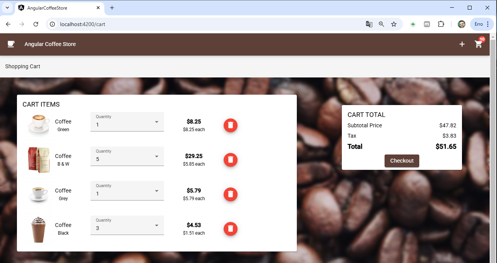

# Angular Coffee Shop


Project created to be added to the portfolio with the aim of demonstrating the Angular skills below:

- Standalone Components and API (Angular v14 and v15)
- Typed Forms (Angular v14)
- Signals (Angular v16)
- Input Validation (Angular v16)
- New Control Flow (Angular v17)

## Screenshots

Main page with products list:

<p align="center">
  
</p>

Cart page:

<p align="center">
  
</p>

## Executing the code locally

You need to have Node.js > v18.20.0 (recommended) / NPM installed locally.

1. Install all the required dependencies:

```
npm install
```

2. Execute the project:

```
npm run start
```

This command will run the Angular project with a proxy to the Java server, without requiring CORS.

Open your browser and access **http://localhost:4200** (Angular default port).
